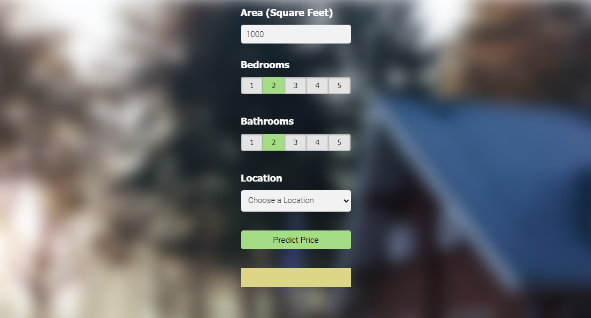

# Banglore House Price Prediction

This project constist of step by step model building and flask server deployment of House Price Predictions in Banglore City of India.

(This project is built with the reference from [codebasics](https://www.youtube.com/playlist?list=PLeo1K3hjS3uu7clOTtwsp94PcHbzqpAdg) on YouTube.)

### Directories
- [BHP](https://github.com/ameyadike/HousePricePrediction/tree/main/BHP)
    - [client](https://github.com/ameyadike/HousePricePrediction/tree/main/BHP/client)
    - [model](https://github.com/ameyadike/HousePricePrediction/tree/main/BHP/model)
    - [server](https://github.com/ameyadike/HousePricePrediction/tree/main/BHP/server)
- [Datasets](https://github.com/ameyadike/HousePricePrediction/tree/main/Datasets)
- README.md

Dataset has been downloaded from [here](https://www.kaggle.com/datasets/amitabhajoy/bengaluru-house-price-data).

The model constist of a `Jupyter notebook` for the data exploration and model training.

Ther server directory consists the flask server files for running the project on local machine.

The Client directory consists of simple html, css and javascript file for the app.

## Instructions
- Install Anaconda distribution on the local machine.
- It comes with jupyter notebook and basic libraries for data science such as numpy, pandas, matplotlib etc.
- If you get any error of library missing, you will need to install the same with `pip`.
- Run [server.py](https://github.com/ameyadike/HousePricePrediction/blob/main/BHP/server/server.py) with `python run server.py`.
- Open [app.html](https://github.com/ameyadike/HousePricePrediction/blob/main/BHP/client/app.html) in your browser and predict the house prices.
- You can make changes in the appearances in your web app by modifying html and css files.

